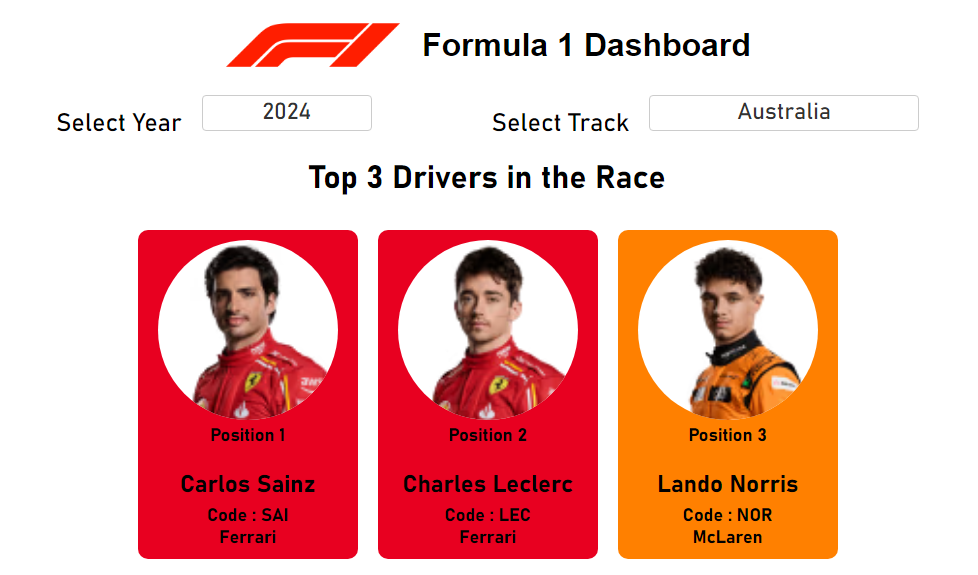
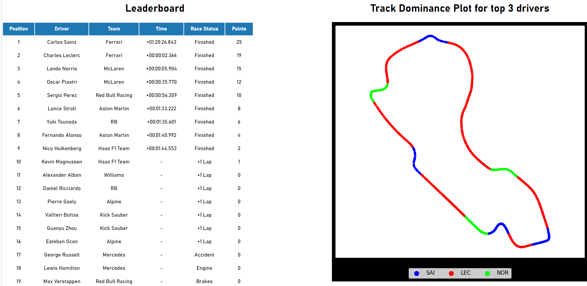
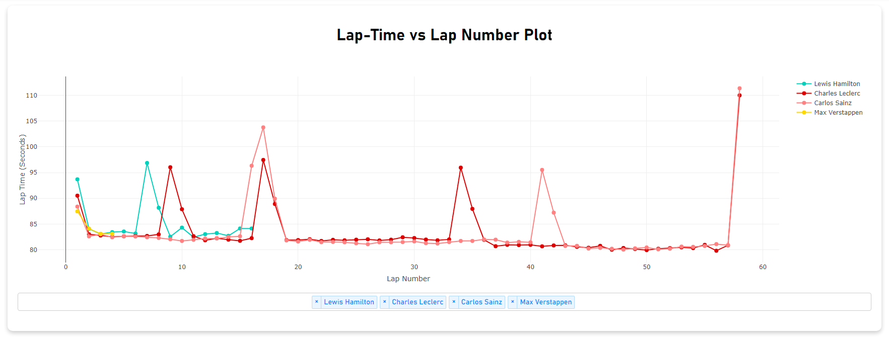
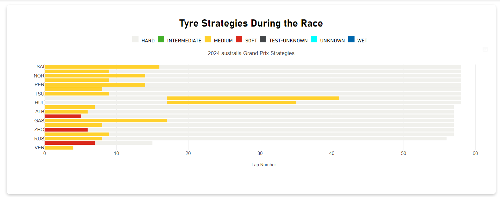
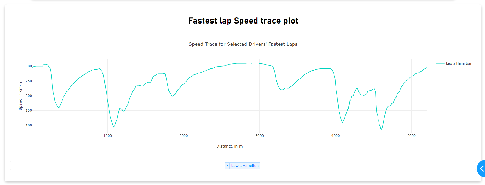

# Formula 1 Dashboard


## Overview

The Formula 1 Dashboard is a web application built using Dash, a Python framework for building analytical web applications.FastF1, a Python library for accessing Formula 1 telemetry and data, is utilized in this project for data sourcing.This dashboard provides insights and visualizations related to Formula 1 races, including top drivers, leaderboard, track dominance, lap-time comparison, tyre strategies, and fastest lap speed trace.This project is created by Rajandeep Singh (B20CS049) as the final project for the course of Data Visualization taught by Dr. Suman Kundu.


## Features

- Select a specific year and race track to view race details.
- View the top 3 drivers of the selected race.
- See the leaderboard with driver positions, times, race status, teams and points.
- Visualize track dominance of top 3 drivers with a plot.This plot highlights the regions of the track where each of the top three drivers dominated.
- Compare lap times of selected drivers using an interactive chart. You can add more drivers from the dropdown below the plot. Please wait 2-3 seconds after selecting the driver to see his plot.The linecolors used are the drivers color in the Fastf1 package.
- Analyze tyre strategies during the race with a horizontal stacked bar plot. This is very useful to find the winning strategy of drivers.
- Track the speed trace of the fastest laps for selected drivers.You can add more drivers from the dropdown below the plot. Please wait 2-3 seconds after selecting the driver to see his plot.The linecolors used are the drivers color in the Fastf1 package.
- The plots are interactive , allowing the user to pan , zoom , select a subsection of the graph to anaylze better or hover over points for additional information.

## Requirements

- Python 3.9.1
- Dependencies listed in `requirements.txt`
- Functioning internet connectivity (for data fetching)

## Installation

1. Clone or download the repository to your local machine.
2. Navigate to the project directory.
3. Create a virtual environment (optional but recommended).
4. Install the required dependencies using the following command:

    ```
    pip install -r requirements.txt
    ```

## Note on Data Loading
This project utilizes a Fastf1 for handling large amounts of data. Each race's data fetched is approximately 80-90MB. Consequently, loading data for a new year and track may take some time initially as it has to download the data. However, the application automatically caches the data, typically in the temporary folder of your Windows system. Alternatively, you can specify a custom path for caching (more on that here [https://docs.fastf1.dev/fastf1.html](https://docs.fastf1.dev/fastf1.html) )

After caching, subsequent data loading is significantly faster, typically taking less than 10 seconds. Despite this optimization, please be patient, as the dashboard performs numerous calculations to generate the plots.In case any plot is not loading (especially the Track Dominance plot for the first time) , please try changing the track location and retry the same location after some time.

## Usage

1. Run the following command to start the Dash application:

    ```
    python f1_dashboard.py
    ```

2. Open a web browser and go to [http://127.0.0.1:8050/](http://127.0.0.1:8050/) to access the dashboard.

## Screenshots

### Top 3 Drivers



### Leaderboard and Track Dominance Plot




### Lap-Time Comparison Chart



### Tyre Strategy Plot 



### Fastest Lap Speed Trace 




## License

Created by Rajandeep Singh (B20CS049)

## Acknowledgments

- The data used in this dashboard is sourced from the FastF1 library.
